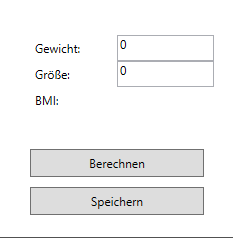

# BMI-Calculator

**Funktion:**

Display GUI and get User Input:

<p align="center">
  
</p>

**Calculate BMI from**

```
double bmi = Weight / Math.Pow(Height / 100, 2);
return Math.Round(bmi, 2);
```

**Also includes some Input Validation**

```
private readonly Regex _validateInputRex = new Regex("^\\d{1,4}[.,]\\d{0,2}$|^\\d{1,4}$");
  private void Txt_PreviewTextInput(object sender, TextCompositionEventArgs e)
        {
            e.Handled = !_validateInputRex.IsMatch(((TextBox)sender).Text + e.Text);
        }

        private void PasteHandler(object sender, DataObjectPastingEventArgs e)
        {
            if (!e.DataObject.GetDataPresent(typeof(string))) return;

            string pasteText = e.DataObject.GetData(typeof(string)) as string;
            if (pasteText != null && !_validateInputRex.IsMatch(pasteText))
            {
                e.CancelCommand();
            }
        }
```

## Where you can find more Stuff about me:

[Sei's Homepage](https://sei-vae.github.io/)
